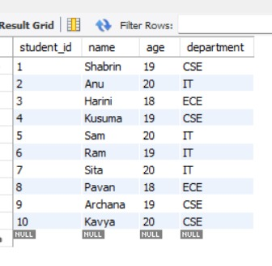

📊 Student Management System (SQL)

📌 Description
This project is a Student Management System built using SQL. It manages students, courses, and marks.

🛠️ Tools Used
- MySQL Workbench
- SQL

📂 Tables
- students
- courses
- marks

🔑 Features
- JOIN operations
- Aggregate functions
- WHERE filtering

🚀 Learning
Learned SQL and database design.

📸 Screenshots

Table

Average Marks Query

Grade Query

Highest Marks Query
